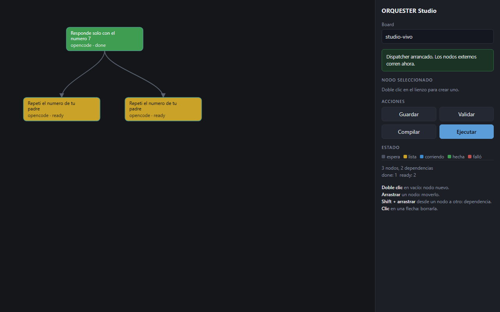
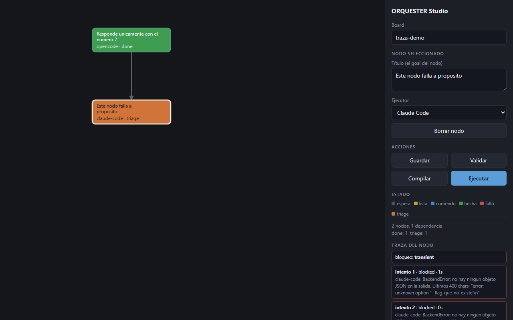

# Studio de ORQUESTER

UI local para diseñar el grafo, compilarlo al kanban y verlo ejecutarse.



_Rombo a mitad de corrida: el padre cerró (verde) y liberó a sus dos hijos (ámbar)._

```bash
uv run --python 3.11 --with jsonschema python ui/server.py
# -> http://127.0.0.1:8765
```

## Por qué stdlib y no React

`http.server` y un HTML de un archivo: sin npm, sin build, sin framework. La
tesis de "gobierno de equipo" (RBAC, SSO, multiusuario, Postgres) todavía no
está validada, y montar el stack de §7 para sostenerla sería andamiaje que
nadie pidió. Cuando haga falta, esto se reemplaza por el backend NestJS.

Escucha en `127.0.0.1` a propósito: ejecuta agentes con acceso a la terminal y
no tiene autenticación. No exponerlo a la red.

## Gestos

- Doble clic en vacío: nodo nuevo
- Arrastrar un nodo: moverlo
- Shift + arrastrar de un nodo a otro: dependencia
- Clic en una flecha: borrarla

## Flujo

1. **Validar** — rechaza ciclos, aristas colgadas, runtimes desconocidos, sin tocar la base
2. **Compilar** — crea las cards y sus dependencias en el board
3. **Ejecutar** — arranca el dispatcher externo; el canvas se pinta solo cada 2.5s

Los nodos `hermes` los ejecuta el dispatcher de Hermes (hay que tenerlo
corriendo aparte); el resto los ejecuta el dispatcher de ORQUESTER (§12).

## Traza por nodo

Clic en un nodo abre su traza: los intentos con su `outcome` y duración, el
error de cada uno si falló, el tipo de bloqueo, y la secuencia de eventos del
kanban (`created`, `promoted`, `claimed`, `blocked`, `unblocked`,
`block_loop_detected`, `completed`).



_Un nodo que falló dos veces y terminó en `triage`: el reintento se agotó y
Hermes lo sacó del bucle para que decida un humano._

Es la "observabilidad como grafo" de `IDEAS.md` §1: se lee la traza en el mismo
dibujo donde se diseñó el flujo, sin traducir un log a un grafo mental.

Los grafos guardados van a `ui/grafos/*.json`.
